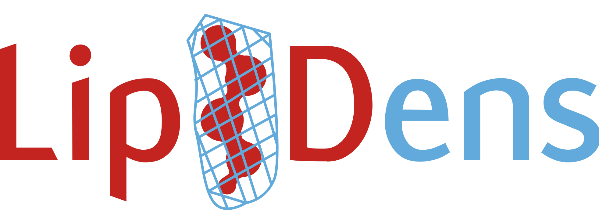

# LipIDens - simulation assisted interpretation of lipid densities 



LipIDens is a pipeline for simulation assisted interpretation of lipid or lipid-like densities in e.g. cryogenic electron microscopy (cryo-EM) structures of membrane proteins. The protocol can be used to establish CG simulations, analyse lipid binding sites using [PyLipID](https://github.com/wlsong/PyLipID), screen, rank and process [PyLipID](https://github.com/wlsong/PyLipID) outputs and establish atomistic simulations to refine lipid binding poses.

LipIDens aims to guide the user from 'lipid-like' to 'lipid-site' to assist membrane protein structure interpretation. 

## Applications:
- Differentiating between sterol and phospholipid binding sites where structural densities are ambiguous. 
- Assess preferential binding of different lipid types to a site where lipid-like density is observed.
- Evaluate whether lipid tail densities are likely to belong to the same or adjacent binding sites. 
- Quantify the kinetics of different lipids binding to the same site.
- Obtain a more complete picture of lipid interactions profiles around the protein in a membrane environment. 
- Assist interpretation of cryo-EM densities during model building and map refinement cycles. 
- Assess which putative lipid binding sites may prevail when not in detergent conditions. 

## Installation:

LipIDens requires a python3 environment (>=3.9 recommended). 

LipIDens installation from the GitHub repository:
```bash
git clone https://github.com/TBGAnsell/LipIDens
cd LipIDens
python setup.py install
```


Conda (legacy installation):
```bash
conda create -n LipIDens python=3.9
pip install -r requirements.txt
```
## Usage

Detailed steps for the usage and implementation of LidIDens are provided within the accompanying protocols manuscript (see citation below). 

LipIDens can be run using the standalone `lipidens_master_run.py` (user inputs variables to terminal) or `master_run.py` (define variables within script a priori) scripts. 

`python lipidens_master_run.py`

Select the required protocol stage when prompted. 

In addition, a jupyter notebook tutorial is provided to assist implementation (`LipIDens.ipynb`). 

## Citation:

**Please cite** the following if elements of the LipIDens protocol are used:

Ansell, T.B., Song, W., Coupland, C.E., Carrique, L., Corey, R.A., Duncan, A.L., Cassidy, C.K., Geurts, M.M.G., Rasmussen, T., Ward, A.B., Siebold, C., Stansfeld, P., Sansom, M.S.P. (2022). **LipIDens: Simulation assisted interpretation of lipid densities in cryo-EM structures of membrane proteins.** bioRxiv, [doi: 10.1101/2022.06.30.498233](https://www.biorxiv.org/content/10.1101/2022.06.30.498233v1)


The LipIDens logo was designed by Jessica Ansell. 

